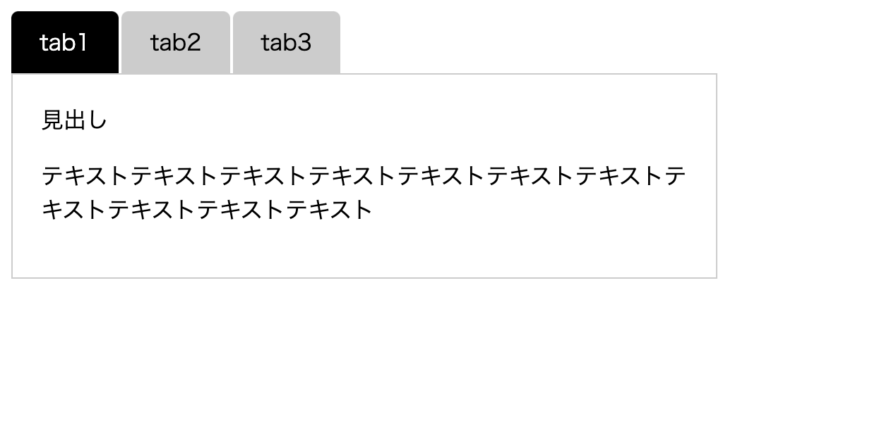

---

theme: "black"
transition: "slide"
slideNumber: false
title: "Webアクセシビリティについて（WAI-ARIAとJS）"

---

##   <div style="text-align:left;">Webアクセシビリティ入門</div>
<div style="color:skyblue;text-align:left;">（WAI-ARIAとJS）</div>

---
##### <div style="text-align:left;">こっぺ</div>
##### <div style="text-align:left;">2021-9-18</div>

---

#### 自己紹介
- こっぺ
- 前職（警察、市役所）
- 現職 Uber配達員（9/21~Web制作会社勤務）
- もりけん塾（8月~）
- 目標（フロントエンジニアとして活躍、JSでゲーム作る）

---

#### Webアクセシビリティ

---

#### <div style="text-align:left;">全てのユーザーが同じ体験を得られるようにすること</div>

---

<div style="width: 200px;color:black;background:white;border-radius:30px;margin:0 auto;box-shadow:0 5px 0 gray;" >見る</div>

<button type="button">見る</button>

---

どちらがボタンとして優れている…？

---

#### Q.スクリーンリーダーではどのように伝わるか

---

##### １つ目のボタン
```
<div>見る</div>
```
<br>

##### あれ、読み上げられない…{.fragment .fade-in-then-semi-out"}
##### とゆうか、フォーカスされない…{.fragment .fade-in-then-semi-out"}

---

##### ２つ目のボタン
```
<button type="button">見る</button>
```
<br>

##### フォーカスが当たる！{.fragment .fade-in-then-semi-out"}
##### 「ボタン、見る」と読み上げられた！{.fragment .fade-in-then-semi-out"}

---

#### つまり、Webアクセシビリティとは
*<span style="color:orange;">支援技術が読み取れるようにセマンティクス（タグを本来の意味で使用）なマークアップをすること*{.fragment .fade-in-then-semi-out"}

---

##### `<div>`ボタンの問題点

- ##### ブラウザがボタンと認識できない{.fragment .fade-in-then-semi-out"}
- ##### CSSでボタンに見えるものを作れてしまう{.fragment .fade-in-then-semi-out"}
- ##### 結果、全てのユーザーが平等に扱えない…{.fragment .fade-in-then-semi-out"}


---

## WAI-ARIA

---

#### <span style="color:skyblue">WAI-ARIA</span>とは

<div style="text-align:left;"><span style="color:skyblue">W</span>eb <span style="color:skyblue">A</span>ccessibility <span style="color:skyblue">I</span>nitiative (W3C の中で、Web アクセシビリティに関する仕様を検討する部会) が策定した、<span style="color:skyblue">A</span>ccessible  な <span style="color:skyblue">R</span>ich <span style="color:skyblue">I</span>nternet <span style="color:skyblue">A</span>pplications に関する仕様です。</div>

---

```
<ul role="tablist">
    <li role="presentation">
        <a role="tab" aria-controls="panel1" aria-selected="true">tab1</a>
        <a role="tab" aria-controls="panel2" >tab2</a>
        <a role="tab" aria-controls="panel3" >tab3</a>
    </li>
</ul>
<div>...
<div>...
```

<span style="font-size:15px;">"ヘイドン・ピカリング(2015) コーディングWebアクセシビリティ"</span>

---

#### <div style="text-align:left;">HTMLの要素に属性を与えることで、支援技術のユーザー向けに情報を追加したり、変更したりする手段を提供している</div>

---

#### 先程のボタンに実装してみる

---

```
<div role="button" aria-label="見る">見る</div>
```

---

WAI-ARIAの３つの機能
- ロール{.fragment .fade-in-then-semi-out"}
- プロパティ{.fragment .fade-in-then-semi-out"}
- ステート{.fragment .fade-in-then-semi-out"}

---

#### ロール
---
*<span style="color:orange;">役割*{.fragment .fade-in-then-semi-out"}
#### RPG風に表現すると…{.fragment .fade-in-then-semi-out"}
*<span style="color:orange;">「職業、種族」剣士、僧侶、魔法使い*{.fragment .fade-in-then-semi-out"}
#### 例）`<div>`に`button`ロールで支援技術がボタンと認識{.fragment .fade-in-then-semi-out"}

---

#### プロパティ
---
*<span style="color:orange;">特性、能力*{.fragment .fade-in-then-semi-out"}
#### RPG風に表現すると…{.fragment .fade-in-then-semi-out"}
*<span style="color:orange;">剣士→剣を装備できる*{.fragment .fade-in-then-semi-out"}
#### 限定されるものもある{.fragment .fade-in-then-semi-out"}
*<span style="color:orange;">魔法は魔法使いしか使えない*{.fragment .fade-in-then-semi-out"}
#### 例）`aria-label`「説明のテキスト追加」{.fragment .fade-in-then-semi-out"}
#### 例）`aria-required`「フォームなどでしか使えない」{.fragment .fade-in-then-semi-out"}

---

#### ステート
---
*<span style="color:orange;">状態*{.fragment .fade-in-then-semi-out"}
#### RPG風に表現すると…{.fragment .fade-in-then-semi-out"}
*<span style="color:orange;">健康状態、どんな装備を身に着けた、誰が仲間に*{.fragment .fade-in-then-semi-out"}
#### 例）`aria-hidden`「目に見える？見えない？」{.fragment .fade-in-then-semi-out"}

---

#### 注意すべきポイント
1. 暗黙のロールで目的を果たせる場合はそれを使う
2. 必要な場合以外ネイティブのセマンティクスを変更しない
3. すべてキーボードで使用できるよう


---

1. 暗黙のロールで目的を果たせる場合はそれを使う

```
<button>
```

#### `暗黙のロール button`{.fragment .fade-in-then-semi-out"}
```
<a>
```

#### `暗黙のロール link`{.fragment .fade-in-then-semi-out"}
<br>

*<span style="color:orange;">備わっているロールを極力使う！*{.fragment .fade-in-then-semi-out"}

---

2. 必要な場合以外ネイティブのセマンティクスを変更しない

```
<h1 role="button">
```

##### `<h1>にbuttonロール…見出しとしての機能を失う`{.fragment .fade-in-then-semi-out"}
```
<h1><button></button></h1>
```
##### 正しい使い方{.fragment .fade-in-then-semi-out"}

<br>

*<span style="color:orange;">本来の機能を失わず、別の機能を追加している*{.fragment .fade-in-then-semi-out"}

---


---

## WAI-ARIAとJS

---

一般的なタブUI

```
<ul>
    <li><a href="#section1">tab1</a></li>
    <li><a href="#section2">tab2</a></li>
    <li><a href="#section3">tab3</a></li>
</ul>
<section id="section1">...</section>
<section id="section2">...</section>
<section id="section3">...</section>
```

<span style="font-size:15px;">"ヘイドン・ピカリング(2015) コーディングWebアクセシビリティ"</span>

---



---

ariaを実装した例

```
<ul role="tablist">
    <li role="presentation">
        <a href="#section1" role="tab" aria-controls="panel1" aria-selected="true">tab1</a>
    </li>
    <li role="presentation">
        <a href="#section2" role="tab" aria-controls="panel2">tab2</a>
    </li>
    <li role="presentation">
        <a href="#section3" role="tab" aria-controls="panel3">tab3</a>
    </li>
</ul>
<section id="section1" role="tabpanel1">...</section>
<section id="section2" role="tabpanel2" aria-hidden="true">...</section>
<section id="section3" role="tabpanel3" aria-hidden="true">...</section>
```

<span style="font-size:15px;">"ヘイドン・ピカリング(2015) コーディングWebアクセシビリティ"</span>

---

<div style="color:skyblue;text-align:left;">tablist</div>

<p style="text-align:left;">tabを収容するロール。</p>

<div style="color:skyblue;text-align:left;">tab</div>

<p style="text-align:left;">ロール。tablistを構成する１つのタブ</p>

<div style="color:skyblue;text-align:left;">tabpanel</div>

<p style="text-align:left;">ロール。tabで定義された１つのタブパネル。</p>

---

<div style="color:skyblue;text-align:left;">presentation</div>

<p style="text-align:left;">要素の元々の意味を取り除く特殊なロール。liのrole="listitem"を打ち消している。</p>


---

<div style="color:skyblue;text-align:left;">aria-selected</div>

<p style="text-align:left;">ステート。現在選択されているアクティブのものを示す。</p>
<div style="color:skyblue;text-align:left;">aria-hidden</div>

<p style="text-align:left;">ステート。trueで非表示に。</p>
<div style="color:skyblue;text-align:left;">aria-controls</div>

<p style="text-align:left;">ステート。tabpanelとの間にリレーションシップを作る。</p>

---


1. tabキーでtab1にフォーカス{.fragment .fade-in-then-semi-out"}
2. 左右矢印キーでtab2、tab3切り替え{.fragment .fade-in-then-semi-out"}
3. tabキーで見出しにフォーカス{.fragment .fade-in-then-semi-out"}
4. shift + tab でtabキーに戻る{.fragment .fade-in-then-semi-out"}

---

<span style="color:skyblue;">tabindex</span>
- tabindex="0"<br>出現順にフォーカスを受け取る
- tabindex="1"..."n"<br>1...nの順番にフォーカスを受け取る
- tabindex="マイナスの値"<br>フォーカスを受け取らない

---

tabindex実装後

```
<ul>
    <li><a>...</a></li>
    <li><a tabindex="-1">...</a></li>
    <li><a tabindex="-1">...</a></li>
</ul>
<section>
    <見出し tabindex="0"></>
</section>
<section>
    <見出し tabindex="0"></>
</section>
<section>
    <見出し tabindex="0"></>
</section>

```

---

#### これで、キーボードで操作できてスクリーンリーダーによってtabと認識され、無事に読み上げられる
*<span style="color:orange;">完成！！！*{.fragment .fade-in-then-semi-out"}

---

#### 感想

- ariaを使いながら慣れていこう
- ariaだけじゃなく、アクセシブルなマークアップ大事

---

#### 参考文献

- [wai-aria MDN](https://developer.mozilla.org/ja/docs/Learn/Accessibility/WAI-ARIA_basics)
- [wai-aria 注意点 zenn](https://zenn.dev/yusukehirao/articles/e3512a58df58fd)
- <span style="font-size:25px;">"ヘイドン・ピカリング(2015) コーディングWebアクセシビリティ"</span>

---

おわり

---
